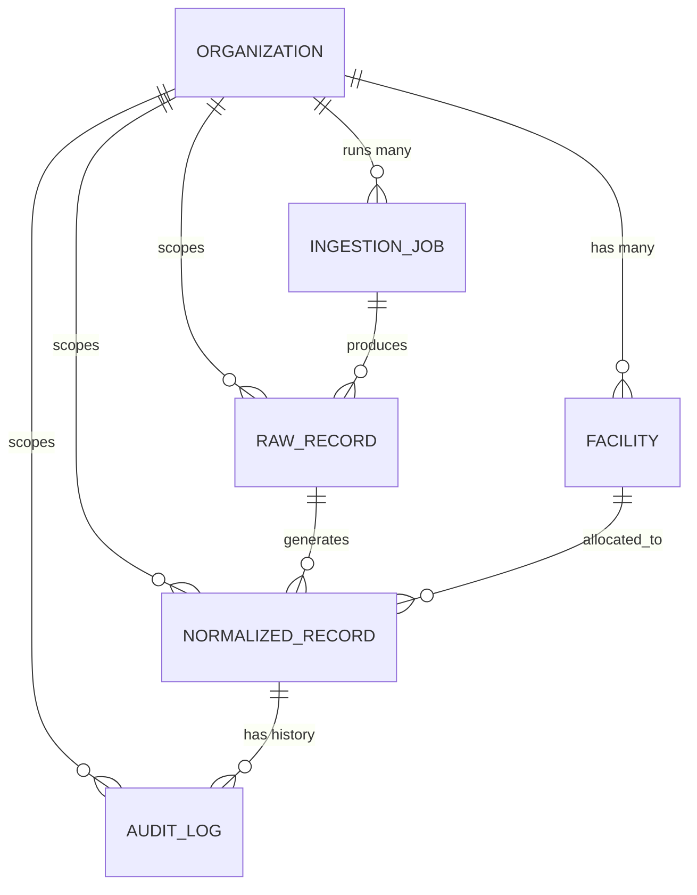

# Breathe ESG Carbon Accounting Platform: Data Model Specification

This document details the multi-tenant, auditable data schema designed for the Breathe ESG Platform prototype.

---

## 1. Schema Entity Relationship Diagram (ERD)

The data model uses a clean relational structure implemented in Django and backed by SQLite for rapid prototyping and auditable query execution.

---

## 2. Core Models and Field Justifications

### `Organization` (Tenant Separation)
*   **Purpose**: Represents a distinct client company. Solves the primary requirement of **multi-tenancy**.
*   **Fields**:
    *   `id`: Primary Key (Auto BigInt).
    *   `name`: Unique string (e.g., "Acme Industrial Corp").
    *   `created_at`: DateTime.
*   **Justification**: All subsequent models maintain a ForeignKey linking to `Organization`. Every view and API controller enforces a tenant scope (e.g., via `X-Organization-ID` headers), ensuring complete isolation between clients.

### `Facility` (Geographic Plant Mapping)
*   **Purpose**: Maps client plant codes (like SAP `WERKS` `DE10`) to physical locations and electricity grid regions.
*   **Fields**:
    *   `plant_code`: CharField (e.g. `DE10`). Scoped uniquely per organization.
    *   `plant_name`: String descriptive name.
    *   `location`: String geographic representation.
    *   `grid_region`: CharField mapping subregion grids (e.g., `eGRID:NYUP`, `Grid:Germany`, `Grid:UK`). Used to dynamically resolve electricity Scope 2 grid emission factors.
*   **Justification**: ERP exports represent locations as short plant codes which are meaningless for carbon calculations. The `Facility` table acts as a translation layer to assign localized grid emission factors.

### `IngestionJob` (Source-of-Truth tracking)
*   **Purpose**: Logs data import events (files or API payloads).
*   **Fields**:
    *   `source_type`: Choice field (`SAP`, `UTILITY`, `TRAVEL`).
    *   `status`: State tracking (`PENDING`, `SUCCESS`, `FAILED`).
    *   `file_name`: String original file name.
    *   `file_size`: Byte size of payload.
    *   `total_rows` / `successful_rows` / `failed_rows`: Execution metrics.
    *   `error_message`: Stack trace or parser error.
*   **Justification**: Crucial for auditable lineage. Analysts can track exactly when, how, and by whom a batch of records was ingested.

### `RawRecord` (Data Lineage / Audit Trail)
*   **Purpose**: Keeps the exact original payload as ingested before normalization or parsing happens.
*   **Fields**:
    *   `raw_payload`: JSONField storing the entire row payload.
*   **Justification**: Compliance requirement. Ensures auditors can verify that the normalization engine did not modify or distort the raw source data (provenance).

### `NormalizedRecord` (Carbon Calculations Hub)
*   **Purpose**: Central normalized activity and emissions ledger.
*   **Fields**:
    *   `transaction_date`: Occurring date (normalized from cycles/postings).
    *   `scope_type`: Choices (`SCOPE_1`, `SCOPE_2`, `SCOPE_3`).
    *   `category`: Choice string (`Diesel`, `Electricity`, `Flight`, `Hotel`, `Procurement`).
    *   `quantity`: Original activity quantity (Decimal).
    *   `unit`: Original unit string (e.g., Liters, Gallons, MWh).
    *   `normalized_quantity`: Converted standard activity quantity (Decimal).
    *   `normalized_unit`: Standard SI unit (e.g., Liters for fuel, kWh for energy, pkm for travel, MT for spend mass).
    *   `emission_factor`: Carbon intensity multiplier (Decimal, tons of CO2e per normalized unit).
    *   `co2e_emissions`: Final emissions output in metric tons of CO2e (Decimal). Formula: `normalized_quantity * emission_factor`.
    *   `status`: Workflow choices (`DRAFT`, `APPROVED`, `FLAGGED`, `REJECTED`).
    *   `validation_warnings`: JSON list of anomaly triggers.
    *   `approved_by` / `approved_at`: Audit signature locking columns.
*   **Justification**: Separates original ingested quantity from normalized quantity to allow dual-verification. A `ForeignKey` relationship to `RawRecord` links the normalized record back to its exact raw source segment, satisfying pro-rata splits.

### `AuditLog` (Immutable Audit Trail)
*   **Purpose**: Immutably records analyst edits and sign-offs.
*   **Fields**:
    *   `user`: Active analyst username.
    *   `action`: Choices (`CREATE`, `UPDATE`, `APPROVE`, `REJECT`).
    *   `previous_values` / `new_values`: JSON snapshots of field states.
    *   `reason`: Mandatory text string detailing *why* the change was made.
*   **Justification**: Essential for audit readiness. If an analyst modifies a quantity or plant code, the previous values, new values, timestamp, and justification reason are captured immutably.

---

## 3. Carbon Categorization & Unit Normalization Design

The platform implements standard carbon accounting categorizations and mathematical unit conversions:

| Source Type | Category | Scope | Original Units | Standard Unit | Emission Factor (tCO2e/Std) |
| :--- | :--- | :--- | :--- | :--- | :--- |
| **SAP** | Diesel | Scope 1 | L, Liters, GAL, Gallons | Liters | `0.00268` (DEFRA Fuel) |
| **SAP** | Natural Gas | Scope 1 | m3, cubic-meters | m3 | `0.00202` (DEFRA Gas) |
| **SAP** | Procurement (Steel) | Scope 3 | KG, Kilograms, MT, Tons | MT | `1.85000` (Lifecycle mass) |
| **SAP** | Procurement (Paper) | Scope 3 | KG, Kilograms, MT, Tons | MT | `0.95000` (Lifecycle mass) |
| **Utility** | Electricity | Scope 2 | kWh, MWh, Megawatt-hours | kWh | Resolved from Grid Region |
| **Travel** | Flight | Scope 3 | Airport codes (Haversine km) | pkm (passenger-km) | `0.000152` * cabin multiplier |
| **Travel** | Hotel Stay | Scope 3 | nights, rooms | room-nights | Resolved by Country standard |
| **Travel** | Ground Transport | Scope 3 | vehicle_class (EV, SUV, Econ) | pkm (passenger-km) | Resolved by vehicle factor |

---

## 4. Why We Chose SQLite for This Prototype
For this 4-day prototype, we configured SQLite in Django's settings. Since SQLite is serverless and lightweight, it requires zero setup or external service dependencies for the reviewer, ensuring the application builds and runs E2E immediately. The schema was built utilizing Django's standard migrations engine, meaning it is 100% ready to drop into PostgreSQL or Amazon RDS for a production environment simply by swapping out the setting engine!
